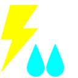
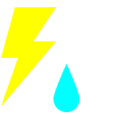
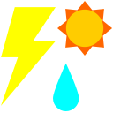
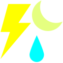
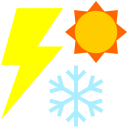
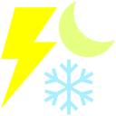
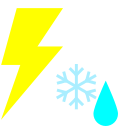
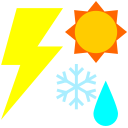
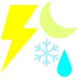

# Xfce4 weather icons

A set of simple weather icons for `xfce4-weather-plugin`.  I wanted something
that would be easy to parse at a glance, even at small sizes.

## Preview

| | | | | | | | |
| - | - | - | - | - | - | - | - |
|  |  |  |  |  |  |  |
|  |  |  |  |  |  |  | 
|  |  |  |  |  |  |  | 
|  |  |  |  |  |  |  | 
|  |  |  |  |  |  |  | 

## Installation

Put the contents of this repo in `/usr/share/xfce4/weather/icons/wisnij` or
`~/.config/xfce4/weather/icons/wisnij` (creating those directories if
necessary).  It should then show up as an icon theme in the weather plugin
appearance properties.

## Bugs

Still not super happy with the various thunder icons; I might change those
later, but then again they come up infrequently enough that I might not.
